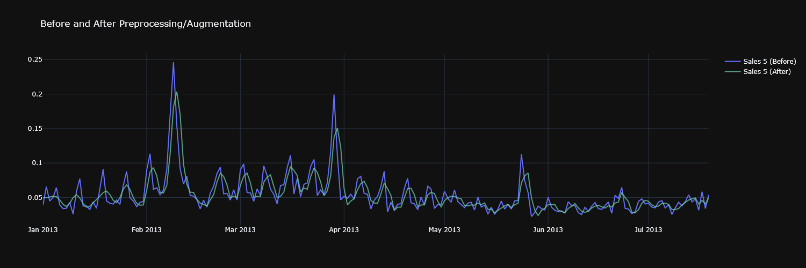
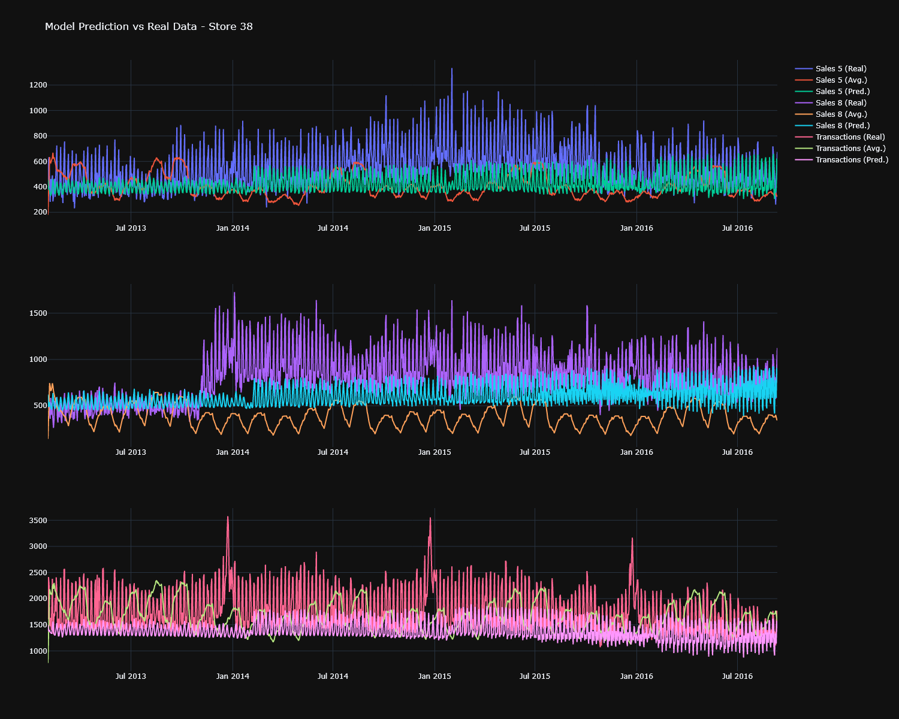
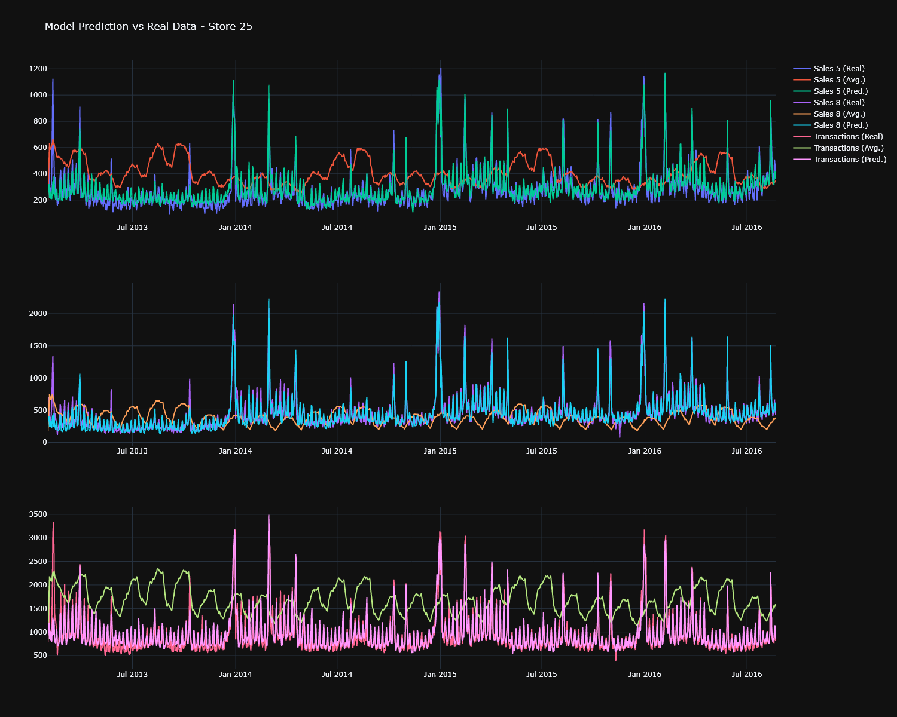

# Favorita Store LSTM
Sales prediction based on real data released by Favorita grocery store (check on [Kaggle](https://www.kaggle.com/competitions/favorita-grocery-sales-forecasting)). The model were trained using repeated `fit`, where each fit used a data from specific store location (stopped at 10 stores).

There's also a custom bicubic interpolation layer in the model (`ImprovedUpSampling1D`), which replace the nearest interpolation behavior (simple repeat value) from Keras `UpSampling1D` layer. It's used to smoothen the data more accurately.

Current model architecture:
``` python
model = keras.models.Sequential([
    Input(shape = (days_past, len(x_col))),
    RandomApply(
        TrainingOnly(AveragePooling1D(pool_size = 3, padding = 'same')),
        rate = 0.4, seed = 1234, name = 'avg_pooling_1'
    ),
    RandomApply(
        TrainingOnly(ImprovedUpSampling1D(size = 3, interpolation = 'bicubic')),
        rate = 0.4, seed = 1234, name = 'up_sampling_1'
    ),

    # --------------------

    LSTM(units = 256, return_sequences = True, name = 'lstm_1'),
    LSTM(units = 128, return_sequences = True, name = 'lstm_2'),
    LSTM(units = 256, return_sequences = True, name = 'lstm_3'),

    TimeDistributed(Dense(units = 128), name = 'dense_1'),
    PReLU(name = 'prelu_1'),
    Dropout(rate = 0.1, name = 'dropout_1'),

    TimeDistributed(Dense(units = 64), name = 'dense_2'),
    PReLU(name = 'prelu_2'),
    Dropout(rate = 0.1, name = 'dropout_2'),

    TimeDistributed(Dense(units = len(y_col)), name = 'dense_3')
])
```

## Screenshots
The screenshots section showcases some of my experiment results in this project. Here's the effect of bicubic upsampling (miles better than nearest neighbor):

<details>
    <summary>Bicubic Upsampling</summary>
    
</details>

General model (trained using multiple stores data) will always have worse result than a store-specific model. Here's the example prediction of a general model:

<details>
    <summary>Sample Prediction (General Model)</summary>
    
</details>

As you can see, the result can be too general or even just straight line in some cases. This can somehow be "fixed" by letting the model overfit on purpose:

<details>
    <summary>Sample Prediction (General Overfit Model)</summary>
    
</details>

It recognized most of the holiday spikes correctly, but of course it still safer to use store-specific model rather than an overfitted general model (which is what I did before making this experiment).

## Todo
- Implement LTTB, and compare the prediction result vs average pooling (current approach)
- Figure out more ways to make the general model more sensitive to holiday spike, or just revert back to simpler algorithm (e.g. ARIMA, univariate LSTM). Time-series clustering next?

